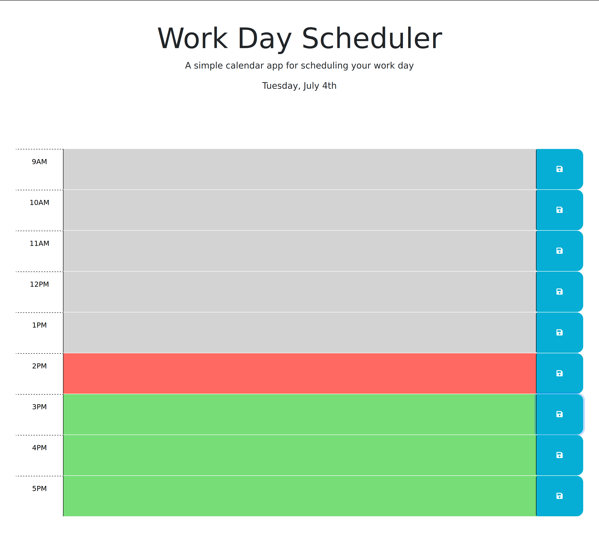

# Work Day Scheduler

## Description
A web app that allows you to keep track of your past, present, and future events throughout the day.

## Usage
Type in your event for the hour. Click the save button to the right and it will save it to local storage.

You can check out the website through this [link](https://ryansheehy0.github.io/Module_5_Challenge/).

## Source code

The source code can be found within the folder docs.
